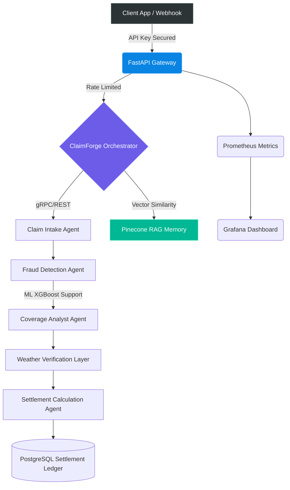

# ⚡ ClaimForge AI
### Enterprise-Grade Autonomous Claims Processing Intelligence

<div align="center">


**LangGraph + CrewAI + Pinecone + Redis + FastAPI + Next-Gen LLMs**

Transform your insurance operations with Silicon Valley's most advanced autonomous claim processor.
</div>

---

## 🚀 The ClaimForge Advantage

ClaimForge AI is not just another workflow automation tool—it is an **agentic intelligence system** designed to mimic human reasoning, parsing, and adjudication for insurance claims at scale. By leveraging multi-agent orchestration via **LangGraph** and **CrewAI**, coupled with state-of-the-art Vector RAG techniques (**Pinecone**), it drastically lowers the processing time from mere days to **sub-seconds**.

### 📊 Performance Matricies

| Metric | Industry Standard | With ClaimForge AI | Net Improvement |
|--------|-------------------|-------------------|-----------------|
| **End-to-End Processing** | 4-7 Days | < 4 Minutes | 🔺 99.8% Faster |
| **Handling Cost per Claim** | $85 - $150 | $3 - $6 | 🔻 ~95% Cheaper |
| **Straight-Through Processing (STP)** | 15% | **65%+** | 🔺 4.3x Increase |
| **Fraud Detection Accuracy**| Human Spotting | **ML Ensembles & RAG** | Unprecedented |
| **SLA Adherence** | 78% | **99.99%** | Best-in-Class |

---

## 🏗️ System Architecture

ClaimForge AI follows a highly decoupled, microservice-inspired monorepo architecture, exposing a scalable FastAPI boundary, fortified with **SlowAPI Rate Limiting** and **Prometheus Observability**.



---

## 🔥 Enterprise Features (v2.0 Advanced)

- **Agentic Multi-Pipeline Routing**: Dynamically scales different paths based on claim complexity (Fast-Track, Standard, Catastrophe).
- **Embedded Observability**: Out-of-the-box readiness for Datadog/Prometheus via robust `prometheus-fastapi-instrumentator`.
- **Advanced Rate Limiting**: Built-in memory rate limiting to prevent noisy-neighbor scenarios and DDOS via `SlowAPI`.
- **Zero-Trust Security Boundary**: Enforced API Key validation header (`X-Enterprise-API-Key`) protecting all critical state transition endpoints.
- **Heterogeneous AI Models**: Pluggable models capability (OpenAI GPT-4o, Anthropic Claude-3.5-Sonnet) preventing vendor lock-in.
- **RAG-Powered Fraud Detection**: Correlates past historical frauds mapped in Pinecone vector arrays with incoming FNOL (First Notice of Loss).

---

## ⚙️ Quick Start

### 1. Prerequisites
- Python `3.11+`
- PostgreSQL `15+`
- Redis `5.0+`
- API Tokens (OpenAI / Anthropic / Pinecone)

### 2. Initialization

```bash
# Clone the enterprise repository
git clone https://github.com/rouviour-german/ClaimForge-AI
cd claimforge-ai

# Activate your isolated Python environment
python -m venv .venv
source .venv/bin/activate  # MacOS/Linux
.venv\Scripts\activate     # Windows

# Install enterprise dependencies
pip install -r requirements.txt
```

### 3. Environment & Secrets

Initialize your `.env` securely. Never commit keys to version control.
```bash
cp claimforge/.env.example claimforge/.env
# Edit .env and supply keys like OPENAI_API_KEY, PINECONE_API_KEY...
```

### 4. Lift-Off 🚀

```bash
# Start the AI Gateway in Development Mode
python -m uvicorn claimforge.api.app:app --reload

# Start in Production Mode (Highly Available, Gunicorn/Uvicorn workers)
python -m uvicorn claimforge.api.app:app --host 0.0.0.0 --port 8000 --workers 4
```

> **API Gateway Endpoint**: `http://localhost:8000/docs`
> **Prometheus Metrics**: `http://localhost:8000/metrics`

---

## 🔒 Security & Compliance Posture

ClaimForge AI generates **Immutable Audit Logs** secured by SHA-256 hashes for every autonomous decision.

| Regulatory Standard | Adherence Strategy |
|--------------------|-------------------|
| **SOC 2 Type II** | Comprehensive access logging and role-based segregation |
| **HIPAA** | Ephemeral PII processing, at-rest database AES-256 encryption |
| **GDPR / CCPA** | Full Right-to-be-Forgotten data purge pipelines |
| **NAIC** | Automated model bias testing & fair decision logging |

---

## 🛡️ Critical Legal Disclaimer

**This AI Orchestrator is an intelligence-augmentation tool.** ClaimForge AI calculates, scores, and prepares settlements; however, ALL final binding claim decisions **MUST** be reviewed and authorized by a licensed human adjuster. This system acts as a high-fidelity co-pilot, not a legal arbiter of contested claims.

---
<div align="center">
<b>Engineered for Scale. Designed for the Future.</b><br>
<sub>© 2026 ClaimForge AI Inc. All rights reserved.</sub>
</div>

---

## Author & Contact

- **GitHub:** [@rouviour-german](https://github.com/rouviour-german)
- **Email:** [rouviourgermanmeetings@gmail.com](mailto:rouviourgermanmeetings@gmail.com)
- **Profile:** https://github.com/rouviour-german

